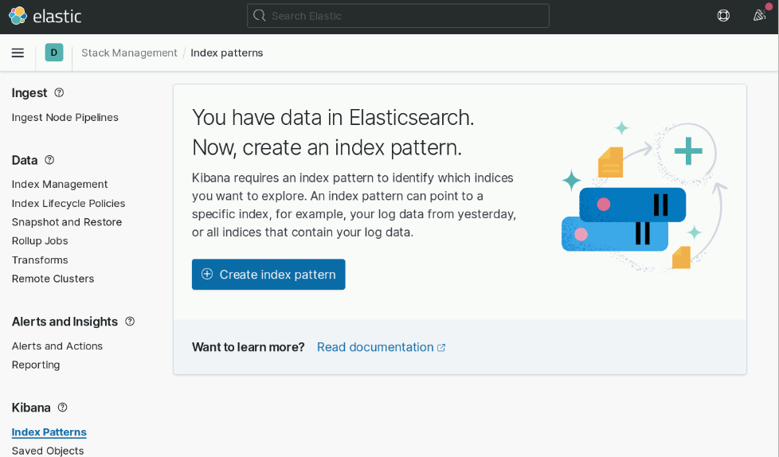
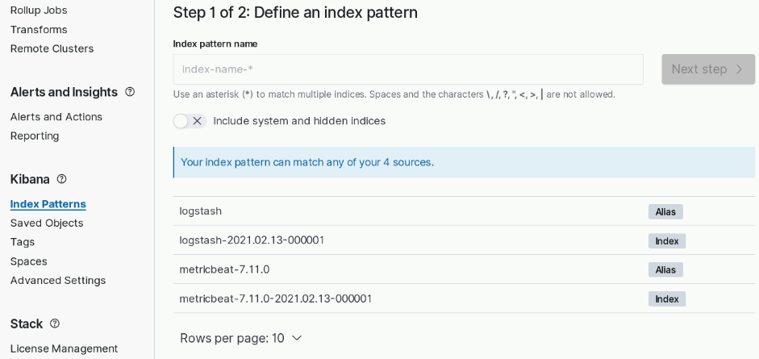
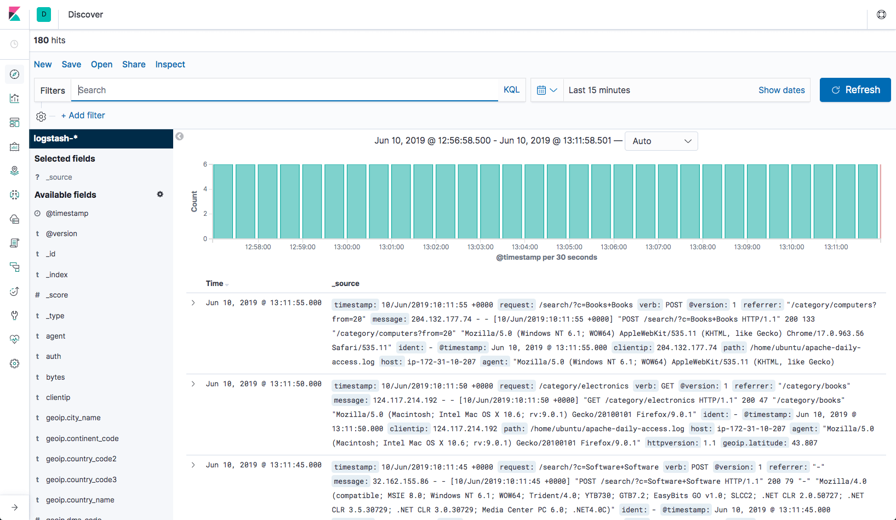

INSTALLATION D'ELK
==
La pile ELK peut être installée à l'aide de diverses méthodes et sur un large
éventail de systèmes d'exploitation et d'environnements différents.
ELK peut être installé localement, sur le cloud, à l'aide de Docker et de
systèmes de gestion de configuration tels que Ansible, Puppet et Chef.

La pile peut être installée à l'aide d'un package tarball ou .zip ou à partir de référentiels.

La plupart des étapes d'installation sont similaires d'un environnement à l'autre
et comme nous ne pouvons pas couvrir tous les différents scénarios,
nous fournirons un exemple pour installer tous les composants de la pile
*Elasticsearch, Logstash, Kibana et Beats* sous Linux.
Vous trouverez ci-dessous des liens vers d'autres guides d'installation.

## Spécifications d'environnement
Pour effectuer les étapes ci-dessous, nous avons configuré une seule machine
Ubuntu 18.04 de 8Go de RAM à l'aide de son stockage local.

Veuillez noter que la version que nous avons installée ici est la 6.2.
Des modifications ont été apportées au modèle de licence dans des versions plus
récentes, notamment l'inclusion des fonctionnalités de base du X-Pack dans
les packages d'installation par défaut.

## Installer Elasticsearch
Tout d'abord, vous devez ajouter la clé de signature d'Elastic afin que le package
téléchargé puisse être vérifié (ignorez cette étape si vous avez déjà installé
des packages depuis Elastic):
```
wget -qO - https://artifacts.elastic.co/GPG-KEY-elasticsearch | sudo apt-key add -
```
Pour *Debian*, nous devons ensuite installer le paquet `apt-transport-https`:
```
sudo apt-get update
sudo apt-get install apt-transport-https
```
L'étape suivante consiste à ajouter la définition du référentiel à votre système:
```
echo "deb https://artifacts.elastic.co/packages/7.x/apt stable main" | sudo tee -a /etc/apt/sources.list.d/elastic-7.x.list
```
Pour installer une version d'Elasticsearch qui ne contient que des fonctionnalités
sous licence Apache 2.0 (alias OSS Elasticsearch):
```
echo "deb https://artifacts.elastic.co/packages/oss-7.x/apt stable main" | sudo tee -a /etc/apt/sources.list.d/elastic-7.x.list
```
Il ne vous reste plus qu'à mettre à jour vos référentiels et installer Elasticsearch:
```
sudo apt-get update
sudo apt-get install elasticsearch
```
Les configurations Elasticsearch sont effectuées à l'aide d'un fichier de configuration
qui vous permet de configurer les paramètres généraux (par exemple le nom du nœud),
ainsi que les paramètres réseau (par exemple l'hôte et le port), où les données
sont stockées, la mémoire, les fichiers journaux, etc.

Pour notre exemple, puisque nous installons Elasticsearch sur VM, il est recommandé
de lier Elasticsearch à une adresse IP privée ou à un hôte local:
```
sudo vim /etc/elasticsearch/elasticsearch.yml
```
```yaml
network.host: "localhost"
http.port: 9200
```
Pour exécuter Elasticsearch, utilisez:
```
sudo systemctl start elasticsearch
```
Pour confirmer que tout fonctionne comme prévu, pointez curl ou votre navigateur
sur http://localhost:9200, et vous devriez voir quelque chose comme la sortie suivante:
```json
{
  "name": "ip-172-31-10-207",
  "cluster_name" : "elasticsearch",
  "cluster_uuid" : "AvwOWbljSiq0X-fINE8nLg",
  "version" : {
    "number" : "7.11.0",
    "build_flavor" : "default",
    "build_type" : "deb",
    "build_hash" : "8ced7813d6f16d2ef30792e2fcde3e755795ee04",
    "build_date" : "2021-02-08T22:44:01.320463Z",
    "build_snapshot" : false,
    "lucene_version" : "8.7.0",
    "minimum_wire_compatibility_version" : "6.8.0",
    "minimum_index_compatibility_version" : "6.0.0-beta1"
  },
  "tagline": "You Know, for Search"
}
```
## Installation de Logstash
Logstash nécessite Java 8 ou Java 11 pour fonctionner, nous allons donc commencer
le processus de configuration de Logstash avec:
```
sudo apt-get install default-jre
```
Vérifiez que java est installé:
```
java -version

version openjdk "1.8.0_191"
Environnement d'exécution OpenJDK (build 1.8.0_191-8u191-b12-2ubuntu0.16.04.1-b12)
VM serveur 64 bits OpenJDK (build 25.191-b12, mode mixte)
```
Puisque nous avons déjà défini le référentiel dans le système, tout ce que nous
avons à faire pour installer Logstash est de lancer:
```
sudo apt-get install logstash
```
Avant d'exécuter Logstash, vous devrez configurer un pipeline de données. Nous y
reviendrons une fois que nous aurons installé et démarré Kibana.

## Installer Kibana
Comme précédemment, nous utiliserons une simple commande apt pour installer Kibana:
```
sudo apt-get install kibana
```
Ouvrez le fichier de configuration Kibana au chemin: `/etc/kibana/kibana.yml`,
et assurez-vous que les configurations suivantes sont définies:
```yaml
server.port: 5601
elasticsearch.url: "http://localhost:9200"
```
Nous allons accéder à kibana à travers l'adresse IP de la VM, pour cela ajouter
cette configuration:
```
network.host: <IP de la VM>
```
Ces configurations spécifiques indiquent à Kibana à quel Elasticsearch se connecter
et quel port utiliser.

Maintenant, démarrez Kibana avec:
```
sudo systemctl start kibana
```
Ouvrez Kibana dans votre navigateur avec: http://<IP de la VM>:5601.
La page d'accueil de Kibana vous sera présentée.


## Installation de Beats
Les différents expéditeurs appartenant à la famille Beats peuvent être installés
exactement de la même manière que nous avons installé les autres composants.

À titre d'exemple, installons Metricbeat:
```
sudo apt-get install metricbeat
```
Pour démarrer Metricbeat, entrez:
```
sudo systemctl start metricbeat
```
Metricbeat commencera à surveiller votre serveur et créera un index Elasticsearch
que vous pourrez définir dans Kibana. Dans l'étape suivante, cependant, nous décrirons
comment configurer un pipeline de données à l'aide de Logstash.

## Expédition de certaines données
Pour les besoins de ce cours, nous avons préparé des exemples de données
contenant des journaux d'accès Apache qui sont actualisés quotidiennement.
Vous pouvez télécharger les données ici: [sample data](https://s3.amazonaws.com/logzio-elk/apache-daily-access.log) et les enregistrer sous le chemin `/var/log/apache-daily-access.log`

Ensuite, créez un nouveau fichier de configuration Logstash à: /etc/logstash/conf.d/apache-01.conf:
```
sudo vim /etc/logstash/conf.d/apache-01.conf
```
Entrez la configuration Logstash suivante (modifiez le chemin du fichier que vous avez téléchargé en conséquence):
```
input {
  file {
    path => "/var/log/apache-daily-access.log"
    start_position => "beginning"
    sincedb_path => "/dev/null"
  }
}
filter {
  grok {
    match => { "message" => "%{COMBINEDAPACHELOG}" }
  }
  date {
    match => [ "timestamp" , "dd/MMM/yyyy:HH:mm:ss Z" ]
  }
  geoip {
    source => "clientip"
  }
}
output {
  elasticsearch {
    hosts => ["localhost:9200"]
  }
}
```
Démarrez Logstash avec:
```
sudo systemctl start logstash
```
Si tout se passe bien, un nouvel index Logstash sera créé dans Elasticsearch,
dont le modèle peut maintenant être défini dans Kibana.

Dans Kibana, accédez à Management → Kibana Index Patterns. et cliquez sur le bouton
`create index pattern`

Kibana devrait afficher l'index Logstash et l'index Metricbeat si vous avez suivi
les étapes d'installation et d'exécution de Metricbeat.


Entrez «logstash-*» comme index pattern, et à l'étape suivante, sélectionnez @timestamp
comme champ Time Filter.


Cliquez sur `create index pattern` et vous êtes prêt à analyser les données.
Accédez à l'onglet **Discover** de Kibana pour consulter les données (regardez les
données du jour au lieu des 15 dernières minutes par défaut).


***Toutes nos félicitations! Vous avez configuré votre premier pipeline de données ELK à l'aide d'Elasticsearch, Logstash et Kibana.***
