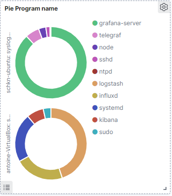

Dans cet atelier, nous acheminons les journaux de rsyslog vers Logstash et ces
journaux seront transférés vers ElasticSearch automatiquement.

## Routage de Logstash vers ElasticSearch

Avant de router les journaux de rsyslog vers Logstash, il est très important que
nous configurions le transfert de journaux entre Logstash et ElasticSearch.
Pour ce faire, nous allons créer un fichier de configuration pour Logstash et lui
dire exactement quoi faire.
Pour créer des fichiers de configuration Logstash, rendez-vous sur /etc/logstash/conf.d
et créez un fichier logstash.conf.
À l'intérieur, ajoutez le contenu suivant:

```
input {                                                                                      
  udp {
    host => "127.0.0.1"
    port => 5000
    codec => "json"
    type => "rsyslog"
  }                                                                                          
}                                                                                            

# The Filter pipeline stays empty here, no formatting is done.
filter { }                                                                                   

# Every single log will be forwarded to ElasticSearch. If you are using another port, you should specify it here.                                                                                             
output {                                                                                     
  if [type] == "rsyslog" {                                                                   
    elasticsearch {
      hosts => [ "localhost:9200"]    
      index => "syslog-%{+YYYY.MM.dd}"
    }                                    
  }         
}
```

Redémarrez votre service Logstash.
```
sudo systemctl restart logstash
```
Pour vérifier que tout fonctionne correctement, exécutez la commande suivante:
```
netstat -na | grep 5000
udp 0 0 192.168.33.10:5000 0.0.0.0:*
```
## Routage de rsyslog vers Logstash
Comme décrit précédemment, rsyslog dispose d'un ensemble de différents modules qui
lui permettent de transférer les journaux entrants vers un large ensemble de destinations.
Rsyslog a la capacité de transformer les journaux à l'aide de modèles. C'est exactement
ce que nous recherchons car ElasticSearch attend JSON comme entrée, et non les chaînes
syslog RFC 5424.
Afin de transférer les journaux dans rsyslog, rendez-vous sur /etc/rsyslog.d et
créez un nouveau fichier nommé 70-output.conf
Dans votre fichier, écrivez le contenu suivant:
```
# This line sends all lines to defined IP address at port 5000
# using the json-template format.
$ModLoad imfile
$InputFileName /var/log/apache2/access.log
$InputFileTag accesslog
$InputFileStateFile accesslog
$InputFileSeverity info
$InputFileFacility local1
$InputRunFileMonitor
$InputFilePollInterval 10
*.*                         @192.168.33.10:5000;json-template
```

Maintenant que vous disposez du transfert de journal, créez un fichier 01-json-template.conf dans le même dossier et collez le contenu suivant:

```
template(name="json-template"
  type="list") {
    constant(value="{")
      constant(value="\"@timestamp\":\"")     property(name="timereported" dateFormat="rfc3339")
      constant(value="\",\"@version\":\"1")
      constant(value="\",\"message\":\"")     property(name="msg" format="json")
      constant(value="\",\"sysloghost\":\"")  property(name="hostname")
      constant(value="\",\"severity\":\"")    property(name="syslogseverity-text")
      constant(value="\",\"facility\":\"")    property(name="syslogfacility-text")
      constant(value="\",\"programname\":\"") property(name="programname")
      constant(value="\",\"procid\":\"")      property(name="procid")
    constant(value="\"}\n")
}
```

Comme vous l'avez probablement deviné, pour chaque message entrant, rsyslog interpolera
les propriétés du journal dans un message au format JSON et le transmettra à Logstash,
en écoutant sur le port 5000.
Redémarrez votre service rsyslog et vérifiez que les journaux sont correctement transmis
à ElasticSearch.

Remarque : les journaux seront transférés dans un index appelé syslog-*.
Redémarrer le service Rsyslog
```
sudo systemctl restart rsyslog
```
Sur la machine elkserver, tester le nouvel indexe
```
curl -XGET 'http://localhost:9200/syslog-*/_search?q=*&pretty'
{
  "took": 2,
  "timed_out": false,
  "_shards": {
    "total": 1,
    "successful": 1,
    "skipped": 0,
    "failed": 0
  },
  "hits": {
    "total": {
      "value": 10000,
      "relation": "gte"
    },
    "max_score": 1,
    "hits": [
      {
        "_index": "logstash-2021.02.08-000001",
        "_type": "_doc",
        "_id": "GEBK1WsBQwXNQFYwP8D_",
        "_score": 1,
        "_source": {
          "host": "127.0.0.1",
          "severity": "info",
          "programname": "memory_usage",
          "facility": "user",
          "@timestamp": "2021-02-09T05:52:21.402Z",
          "sysloghost": "schkn-ubuntu",
          "message": "                                  Dload  Upload   Total   Spent    Left  Speed",
          "@version": "1",
          "procid": "16780",
          "type": "rsyslog"
        }
      }
    ]
  }
}
```
Nous savons que les journaux rsyslog sont directement stockés dans ElasticSearch.
Il est temps pour nous de construire notre tableau de bord final à Kibana.

## Construire un tableau de bord de journal dans Kibana
Nous allons construire le tableau de bord présenté dans la première partie et donner
du sens aux données que nous avons collectées.
À l'instar de notre article sur la surveillance des processus Linux , cette partie
est divisée en fonction des différents panneaux du tableau de bord final, alors
n'hésitez pas à passer à la section qui vous intéresse.

##

Afin de créer un tableau de bord, vous devrez créer des visualisations. Kibana
dispose de deux panneaux pour cela, l'un appelé Visualize et l'autre appelé Dashboard

Afin de créer votre tableau de bord, vous allez d'abord créer chaque visualisation
individuelle avec le panneau Visualiser et les enregistrer.
Lorsque tous seront créés, vous les importerez un par un dans votre tableau de bord final.

Dirigez-vous vers le panneau « Visualize », et commençons par un premier panneau.

### Aggregated bar chart for processes
Pour créer votre premier tableau de bord, cliquez sur « Créer une nouvelle visualisation » dans le coin supérieur droit de Kibana. Choisissez un panneau à barres verticales.

L'objectif principal est de créer un panneau qui ressemble à ceci:

Comme vous pouvez le voir, le graphique à barres fournit un nombre total de journaux par processus, de manière agrégée.
![]
Le graphique à barres peut également être divisé par hôte si vous travaillez avec plusieurs hôtes.

Voilà que doit-on faire:


### Pie by program name

De manière très similaire à ce que nous avons fait auparavant, l'objectif est de créer un panneau circulaire qui divise les proportions du journal par nom de programme.


### Pie by severity
Ce panneau ressemble exactement à celui que nous avons fait auparavant, sauf qu'il divise les journaux par gravité.
Cela peut être très utile lorsque vous avez une panne majeure sur l'un de vos systèmes et que vous voulez voir rapidement que le nombre d'erreurs augmente très rapidement.
Il fournit également un moyen simple de voir le récapitulatif de la gravité de votre journal sur une période donnée si vous êtes intéressé, par exemple, à voir quelles gravité se produisent pendant la nuit ou lors d'événements particuliers.


### Monitoring SSH entries
Celui-ci est un peu spécial, car vous pouvez aller directement dans l' onglet «Découvrir» pour construire votre panel.
Lorsque vous entrez dans l'onglet de découverte, votre «logstash- *» doit être automatiquement sélectionné.
À partir de là, dans la barre de filtre, tapez le filtre suivant «nom du programme: ssh *» .
Comme vous pouvez le voir, vous avez maintenant un accès direct à tous les journaux liés au service SSHd sur votre machine. Vous pouvez par exemple suivre les tentatives d'accès illégales ou les mauvaises connexions.

Pour qu'il soit accessible dans le panneau du tableau de bord, cliquez sur l' option «Enregistrer» , et donnez un nom à votre panneau.
Maintenant, dans le panneau du tableau de bord, vous pouvez cliquer sur «Ajouter», et choisir le panneau que vous venez de créer.
Joli! Maintenant, votre panneau est inclus dans votre tableau de bord, à partir du panneau de découverte.

