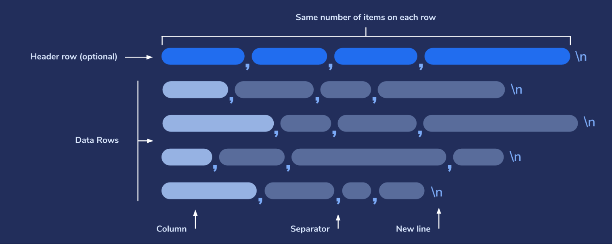

Logstash CSV: Import & Parse Your Data
Le format de fichier CSV est largement utilisé dans le monde des affaires et de l'ingénierie en tant que fichier commun pour l'échange de données. Les concepts de base sont assez simples, mais contrairement à JSON qui est plus standardisé, vous êtes susceptible de rencontrer différentes saveurs de données CSV. Cet atelier vous prépare à comprendre comment importer et analyser des fichiers CSV à l'aide de Logstash avant d'être indexés dans Elasticsearch.

Qu'est-ce qu'un CSV?
CSV, abréviation de Virgule Separated Format, est un format de fichier populaire qui stocke des données tabulaires et est utilisé par des tableurs tels que Microsoft Excel et Google Sheets.


Voici un bref aperçu des règles générales du format CSV:

Le délimiteur définit les limites entre les listes d'éléments du fichier. Le nom CSV correspond à des valeurs séparées par des virgules, car ces fichiers utilisent principalement des virgules comme délimiteur.
CSV organise les données dans le même nombre d'éléments par ligne, de sorte que chaque ligne a le même nombre d'éléments, même si certains d'entre eux sont vides. Cela permet à un programme d'analyser de manière fiable chaque élément ou d'effectuer une recherche rapide dans une colonne entière, au lieu d'une ligne par ligne.
Chaque ligne du fichier est séparée par un caractère de nouvelle ligne.
Les en-têtes de colonne, qui décrivent les données de chaque colonne, apparaissent généralement comme la première ligne du fichier CSV, mais il s'agit d'une ligne facultative. Toutes les autres lignes qui suivent incluent les données réelles.
Certaines parties comme les lignes d'en-tête sont facultatives, et bien que de nombreux CSV utilisent des virgules pour séparer les éléments contenus dans le fichier, en réalité, ce séparateur peut être n'importe quel caractère, de sorte que la même configuration d'analyse peut ne pas fonctionner pour tous les fichiers CSV.


La première ligne ici est la «ligne d'en-tête» et définit les noms des champs . Les lignes suivantes affichent les valeurs réelles de ces champs de ligne d'en-tête.

Un programme qui traite ces données CSV associera le premier champ de «nom» à la première valeur de chaque ligne suivante après l'en-tête. En d'autres termes, John, Basil et Bella seraient tous associés au champ «nom».

Ce processus d'interprétation des données, d'extraction de valeurs et de conversion dans le processus dans un autre format est généralement appelé analyse .

## Création du fichier CSV
Créons un répertoire pour enregistrer le fichier CSV avec lequel nous travaillerons:

Ensuite, nous pouvons télécharger les exemples de données CSV à partir du référentiel Github et les ajouter au dossier que nous venons de créer avec la commande suivante:

Ce fichier CSV contient un exemple de données du journal des informations de paiement contenant divers clients ainsi que leur adresse IP, leur sexe, leur pays, etc.

Voyons maintenant ce qu'il y a dans le fichier CSV en tapant la commande:
```
id,timestamp,paymentType,name,gender,ip_address,purpose,country,age
1,2019-08-29T01:53:12Z,Amex,Giovanna Van der Linde,Female,185.216.194.245,Industrial,Philippines,55
2,2019-11-16T14:55:13Z,Mastercard,Rod Edelmann,Male,131.61.251.254,Clothing,China,32
...
```
Il est important qu'il n'y ait pas de lignes vides dans ce fichier CSV, sinon Logstash tentera de les traiter. S'il y a des lignes vides, Logstash essaiera de les analyser et les lignes seront toujours indexées, mais sans champs associés. Donc, en fait, les lignes vides créeront des documents vides dans Elasticsearch, ce qui nous obligera à augmenter inutilement le nombre de documents.

## Configuration de Logstash
Nous utiliserons un fichier de configuration pour indiquer à Logstash comment exécuter l'opération d'importation.

sudo vi /etc/logstash/conf.d/csv-read.conf

Pour commencer, nous voudrions que le fichier de configuration Logstash copie simplement
les données du fichier csv à l'aide du plug-in d'entrée et les affiche sur la sortie standard.
```
input {
   file {
      path => "/path/to/file/csv-schema-short-numerical.csv"
      start_position => "beginning"
      sincedb_path => "/dev/null"
   }
}
output {
   stdout {}
}
```

La partie `input` définie la source de données seront traitées par **Logstash**.
Nous utilisons le plugin `file` qui permet de charger une source de données à partir
d'un fichier local.

le paramètre `start_position` indique à Logstash de commencer la lecture du fichier
à partir du début, sinon il va l'ouvrir, positionne la tête de lecture à la fin
et attend que de nouvelle data sera écrites pour la traiter (logique de fichier log).

`sincedb_path` pointe vers un fichier de base de données qui conserve la trace de la dernière ligne analysée dans un fichier d'entrée (dans ce scénario, le fichier CSV). La prochaine fois que le fichier d'entrée serait analysé, le processus continuerait à partir de la position enregistrée dans le fichier sincedb. Ici, nous définissons ceci sur «/dev/null» afin que Logstash ne puisse pas enregistrer la dernière ligne qu'il a précédemment lue pour ce fichier particulier. De cette façon, il traitera le fichier entier à chaque fois, depuis le début, plutôt que de continuer là où il s'était arrêté.

La partie `output` du fichier conf, indique à Logstash ce qu'il doit faire avec les données.
`stdout` fera que l'action d'importation affichera sa sortie d'état et ses informations de journalisation dans le terminal.

#### Exécution de Logstash avec le fichier de configuration
```
sudo /usr/share/logstash/bin/logstash -f /etc/logstash/conf.d/csv-read.conf
```

Voilà la sortie attendue sur le terminal:
```
{
          "path" => "/home/vagrant/csv-schema-short-numerical.csv",
      "@version" => "1",
          "host" => "server",
       "message" => "1,2019-08-29T01:53:12Z,Amex,Giovanna Van der Linde,Female,185.216.194.245,Industrial,Philippines,55\r",
    "@timestamp" => 2021-02-14T08:11:26.636Z
}
{
          "path" => "/home/vagrant/csv-schema-short-numerical.csv",
      "@version" => "1",
          "host" => "server",
       "message" => "3,2019-10-07T03:52:52Z,Amex,Michaella Gerrietz,Female,208.21.209.84,Computers,Thailand,32\r",
    "@timestamp" => 2021-02-14T08:11:26.637Z
}
...
```

Cette sortie montre que nos entrées ont été importées avec succès.

## Utilisation des filtres logstash

La partie `filter` permet de formatter les données avant de les rediriger vers la
sortie, ce qui aide **elasticsearch** pour une meilleure indexation.

Dans notre example, nous voudrions aider logstash à décomposer les données CSV pour les indexer par champ.
pour celà, nous utilisons le plugin de filtrage `csv`:

Nous allons utiliser « csv » comme sous-section pour spécifier que c'est le type
de fichier que nous avons l'intention d'analyser.
Dans ce cadre, nous déclarons les options suivantes:
* **separator** où nous passons le caractère virgule «,». De cette façon, Logstash saura que les virgules sont utilisées comme délimiteur pour séparer les champs.
* **skip_header** est important ici, disant à l'analyseur d'ignorer la première ligne, qui indique uniquement les noms de colonnes et non les champs de données réels que nous avons l'intention d'importer.
* **columns** où nous spécifions les noms des colonnes qui seront importées. Dans ce cas, nous disons à notre analyseur que le premier champ de chaque ligne est un ID, le second est un horodatage, et ainsi de suite, jusqu'au dernier qui est un âge.

```
filter {
  csv {
      separator => ","
      skip_header => "true"
      columns => ["id","timestamp","paymentType","name","gender","ip_address","purpose","country","age"]
  }
}
```


Voyons maintenant la nouvelle sortie;

```
{
     "@timestamp" => 2021-02-14T08:38:38.603Z,
     "ip_address" => "131.61.251.254",
       "@version" => "1",
            "age" => "32",
        "message" => "2,2019-11-16T14:55:13Z,Mastercard,Rod Edelmann,Male,131.61.251.254,Clothing,China,32\r",
    "paymentType" => "Mastercard",
           "path" => "/home/vagrant/csv-schema-short-numerical.csv",
           "name" => "Rod Edelmann",
           "host" => "prometheus",
      "timestamp" => "2019-11-16T14:55:13Z",
             "id" => "2",
         "gender" => "Male",
        "purpose" => "Clothing",
        "country" => "China"
}
{
     "@timestamp" => 2021-02-14T08:38:38.603Z,
     "ip_address" => "196.160.55.198",
       "@version" => "1",
            "age" => "51",
        "message" => "4,2019-07-05T22:58:10Z,Mastercard,Thornie Harbor,Male,196.160.55.198,Toys,Poland,51\r",
    "paymentType" => "Mastercard",
           "path" => "/home/vagrant/csv-schema-short-numerical.csv",
           "name" => "Thornie Harbor",
           "host" => "prometheus",
      "timestamp" => "2019-07-05T22:58:10Z",
             "id" => "4",
         "gender" => "Male",
        "purpose" => "Toys",
        "country" => "Poland"
}
...
```

Vous pouvez voir que **Logstash** a pu extraire le contenu de chaque colonne du fichier csv
et l'a correspondu à un champ selon l'ordre.

## Elasticsearch as output

Redirigeons maintenant la sortie vers Elasticsearch, dans ce cas nos allos faire appel au plugin de sortie elasticsearch comme suit:

```
output {
   elasticsearch {
     hosts => "http://localhost:9200"
     index => "demo-csv"
  }

stdout {}

}
```

L'option **hosts** spécifie l'hôte et le port où notre Elasticsearch accepte les connexions entrantes.
L'option **index** définit le nom de l'index Elasticsearch dans lequel les données importées seront stockées.

Testons cette nouvelle configuration:
```
sudo /usr/share/logstash/bin/logstash -f /etc/logstash/conf.d/csv-read.conf
```
Dans la sortie, nous pouvons voir cette ligne :
```
[INFO ] 2021-02-14 08:50:10.607 [Ruby-0-Thread-5: :1] elasticsearch - Attempting to install template {:manage_template=>{"index_patterns"=>"logstash-*", "version"=>60001, "settings"=>{"index.refresh_interval"=>"5s", "number_of_shards"=>1}, "mappings"=>{"dynamic_templates"=>[{"message_field"=>{"path_match"=>"message", "match_mapping_type"=>"string", "mapping"=>{"type"=>"text", "norms"=>false}}}, {"string_fields"=>{"match"=>"*", "match_mapping_type"=>"string", "mapping"=>{"type"=>"text", "norms"=>false, "fields"=>{"keyword"=>{"type"=>"keyword", "ignore_above"=>256}}}}}], "properties"=>{"@timestamp"=>{"type"=>"date"}, "@version"=>{"type"=>"keyword"}, "geoip"=>{"dynamic"=>true, "properties"=>{"ip"=>{"type"=>"ip"}, "location"=>{"type"=>"geo_point"}, "latitude"=>{"type"=>"half_float"}, "longitude"=>{"type"=>"half_float"}}}}}}}
```

Ceci indique que Elasticsearch a créé un nouveau template pour indexer les données provenant de Logstash.

Nous pouvons vérifier les données qui ont été insérées, avec cette requête cURL:
```
curl -XGET localhost:9200/demo-csv/_search?pretty=true
```

La sortie devrait ressembler à ceci:

```
{
  "took" : 487,
  "timed_out" : false,
  "_shards" : {
    "total" : 1,
    "successful" : 1,
    "skipped" : 0,
    "failed" : 0
  },
  "hits" : {
    "total" : {
      "value" : 8,
      "relation" : "eq"
    },
    "max_score" : 1.0,
    "hits" : [
      {
        "_index" : "demo-csv",
        "_type" : "_doc",
        "_id" : "pMBjn3cBueibEHDs7qie",
        "_score" : 1.0,
        "_source" : {
          "message" : "1,2019-08-29T01:53:12Z,Amex,Giovanna Van der Linde,Female,185.216.194.245,Industrial,Philippines,55\r",
          "@timestamp" : "2021-02-14T07:14:21.893Z",
          "@version" : "1",
          "gender" : "Female",
          "name" : "Giovanna Van der Linde",
          "country" : "Philippines",
          "host" : "prometheus",
          "ip_address" : "185.216.194.245",
          "age" : "55",
          "id" : "1",
          "paymentType" : "Amex",
          "path" : "/home/vagrant/csv-schema-short-numerical.csv",
          "timestamp" : "2019-08-29T01:53:12Z",
          "purpose" : "Industrial"
        }
      },
      {
        "_index" : "demo-csv",
        "_type" : "_doc",
        "_id" : "pcBjn3cBueibEHDs7qie",
        "_score" : 1.0,
        "_source" : {
          "message" : "3,2019-10-07T03:52:52Z,Amex,Michaella Gerrietz,Female,208.21.209.84,Computers,Thailand,32\r",
          "@timestamp" : "2021-02-14T07:14:21.896Z",
          "@version" : "1",
          "gender" : "Female",
          "name" : "Michaella Gerrietz",
          "country" : "Thailand",
          "host" : "prometheus",
          "ip_address" : "208.21.209.84",
          "age" : "32",
          "id" : "3",
          "paymentType" : "Amex",
          "path" : "/home/vagrant/csv-schema-short-numerical.csv",
          "timestamp" : "2019-10-07T03:52:52Z",
          "purpose" : "Computers"
        }
...
```

Il y a beaucoup d'informations utiles dans cette sortie. Par exemple, il nous montre le fichier qui a été utilisé pour les données importées, les noms de colonne, les valeurs de champ, etc.

## Logstash Mutate Filter Plugin

Jusqu'à présent, nous n'avons joué qu'avec les bases de l'importation de fichiers CSV, mais nous pouvons déjà voir que c'est assez simple.

Mais c'est uniquement parce que nous n'avons pas été pointilleux sur la nature exacte des données. Cependant, à d'autres moments, nous devrons peut-être être précis sur les données que nous utilisons et comment. Par exemple, il se peut que nous devions ignorer l'importation de certains champs inutiles, modifier le mappage des champs sélectionnés, convertir le type de données de certaines valeurs ou les traiter d'une autre manière, en changeant tous les caractères en majuscules, par exemple.

Ces types de scénarios peuvent être configurés en ajoutant une autre entrée à notre configuration Logstash située dans la section de filtrage appelée `mutate` .

```
mutate {
    convert => {
        age => "integer"
    }
    remove_field => ["message","@timestamp","path","host","@version"]
}
```

Dans cet exemple, la section de filtre a deux entrées principales: « csv » et « mutate ».

Gardez à l'esprit que l'ordre dans lequel ils apparaissent est important. Dans ce cas, les paramètres de la section «csv» seront appliqués en premier, et ce n'est qu'ensuite que ceux de «mutate» seront appliqués.

La section de conversion est assez simple. Toutes les valeurs du champ age seront converties en valeurs entières. Par exemple, la valeur d'âge de "30,5" sera convertie en valeur entière «30».

Sous `remove_field`, nous spécifions tous les champs que nous voulons supprimer.

Maintenant, nous pouvons exécuter Logstash avec ces nouveaux paramètres avec cette commande:
```
sudo /usr/share/logstash/bin/logstash -f /etc/logstash/conf.d/csv-read.conf
```
Une fois l'action terminée, appuyez sur CNTRL+C pour quitter l'écran d'exécution.

Maintenant, vérifions si les champs ont été supprimés comme nous l'avons spécifié dans le fichier de configuration avec la commande cURL suivante:
```
curl -XGET "http://localhost:9200/demo-csv/_search?pretty=true" -H 'Content-Type: application/json' -d'{  "size":1}'
```
```
{
  "_index" : "demo-csv",
  "_type" : "_doc",
  "_id" : "q8DJn3cBueibEHDsBKgL",
  "_score" : 1.0,
  "_source" : {
    "paymentType" : "Amex",
    "timestamp" : "2019-10-07T03:52:52Z",
    "ip_address" : "208.21.209.84",
    "age" : 32,
    "name" : "Michaella Gerrietz",
    "country" : "Thailand",
    "id" : "3",
    "purpose" : "Computers",
    "gender" : "Female"
  }
}
```

Nous pouvons voir ici que les champs que nous avons spécifiés ont bien été supprimés, comme prévu.

Vérifions également le mappage de l'index nommé «demo-csv»:

```
curl -XGET "http://localhost:9200/demo-csv/_mapping/field/age?pretty=true"
```
Une réponse comme celle-ci nous montre qu'en effet, le champ age est du type de données entier que nous avons spécifié. Notez qu'il est appelé «long» ici, mais c'est juste un type entier, appelé un entier long, qui peut stocker plus de chiffres qu'un entier court.
```
{
  "demo-csv" : {
    "mappings" : {
      "age" : {
        "full_name" : "age",
        "mapping" : {
          "age" : {
            "type" : "text",
            "fields" : {
              "keyword" : {
                "type" : "keyword",
                "ignore_above" : 256
              }
            }
          }
        }
      }
    }
  }
}
```
