## Introduction
Après avoir installé la suite ELK dans le lab précédent. Nous allons dans ce lab pratiquer
et s'initier à l'utilisation des différents composants de la stack ELK en analysant en temps réel
les logs d'accès Apache.

### Prérequis
Pour bien suivre cet atelier, vous devez au préalable installer et démarrer le package
d'Apache sur votre machine ELK. Pour cela, lancez les commandes suivantes :

Pour la famille Debian :
```
sudo apt-get install -y apache2
```
Pour la famille Redhat :
```
sudo yum install -y httpd
```
Utilisez l'outil systemctl pour démarrer le service Apache :

Pour la famille Debian :
```
sudo systemctl start apache2
```

Pour la famille Redhat :
```
sudo systemctl start httpd
```
Enfin, très important, n'oubliez pas de rajouter l'utilisateur *logstash* au groupe *adm* :
```
sudo usermod -aG adm logstash
```
:information_source: Information
>Le groupe d'utilisateurs adm est utilisé pour permettre à ses membres de lire le contenu des fichiers de logs.

## Logstash
La première étape à effectuer est le traitement des logs sous forme d'un ou plusieurs
pipelines avec l'outil **Logstash**.

Comment fonctionne de **Logstash**? Il est capable d'extraire des données de presque
n'importe quelle source de données à l'aide des **plugins d'entrée**, et d'appliquer
une grande variété de *transformations* et d'*améliorations* de données à l'aide de
**plugins de filtre** et enfin d'expédier ces données vers un grand nombre de destinations
à l'aide de **plugins de sortie**. Vous comprendrez alors que **Logstash** joue un
rôle très important dans la pile en récupérant, filtrant et expédiant vos données
afin de les utiliser plus facilement sur le reste des composants.

Pour utiliser **Logstash**, il faut créer des fichiers de configuration qui contiendront
trois sections principales que nous allons par passer en revue ci-dessous. À savoir
que chacune de ces sections est responsable de différentes fonctions et utilisant
différents plugins **Logstash**.

Commencez déjà par créer un fichier `apache.conf` dans le dossier de configuration
**Logstash** situé dans `/etc/logstash/conf.d/` et rajoutez-y les *trois sections*
de configuration principales qui seront pour le moment vide :
```
input {}

filter {}

output {}
```
### Entrées **Logstash**
Les points de départ de toute configuration **Logstash** sont vos entrées. Les entrées sont des plugins **Logstash** responsables de la récupération des données de différentes sources de données. Vous trouverez l'intégralité des plugins d'entrée [ici](https://www.elastic.co/guide/en/logstash/current/input-plugins.html). Pour notre exemple, nous avons besoin de récupérer les données depuis un fichier donc nous utiliserons le plugin d'entrée [file](https://www.elastic.co/guide/en/logstash/current/plugins-inputs-file.html) , comme suit :

Pour la famille debian :
```
input {
    file { path => "/var/log/apache2/access.log" }
}
...
```
Pour la famille redhat :
```
input {
    file { path => "/var/log/httpd-access.log" }
}
...
```
En regardant la documentation du plugin d'entrée file , vous remarquerez que vous pouvez utiliser différents paramètres pour cette entrée. Comme par exemple, le paramètre start_position qui permet de choisir où **Logstash** doit commencer sa lecture initiale des fichiers, soit au début ou à la fin. La valeur par défaut est `end` qui traite les fichiers comme des flux direct en temps réel (comme la commande tail -f) et comme son nom l'indique, la lecture débutera à partir de la *fin du fichier*, mais si vous souhaitez lire un fichier depuis le **début**, forcez alors la valeur à beginning :
```
input {
    file {
        path => "/var/log/apache2/access.log"
        start_position => "beginning"
        sincedb_path => "/dev/null"
    }
}
...
```
Par défaut, logstash écrit la dernière position de lecture dans un fichier log qui réside généralement dans `$HOME/.sincedb` ou dans le dossier `/var/lib/logstash/plugins/inputs/file/`. Afin de forcer la relecture complète d'un fichier à chaque exécution de logstash, il faut changer le chemin du fichier de logs de position en valorisant `sincedb_path` à */dev/null*. Ou sinon vous pouvez supprimer uniquement la ligne correspondante de votre fichier .sincedb et redémarrez le service logstash.

### Filtres **Logstash**
Les filtres sont des modules qui vont traiter les données récupérées depuis l'input en s'aidant lui aussi de différents plugins de filtrage. Pour notre exemple, nous utiliserons le plugin **grok** qui vous permet d'analyser facilement des données de logs non structurées en quelque chose de plus exploitable en utilisant des expressions régulières. Cet outil est parfait pour tout format de logs généralement écrit pour les humains comme les logs applicatifs (ex: mysql, apache, nginx, etc ...).

La syntaxe d'un pattern grok est la suivante : **`%{SYNTAX:SEMANTIC}`**

**SYNTAX** : nom du pattern qui correspond à un filtre prédéfini, comme par exemple le pattern *NUMBER* qui prend en compte des nombres tel quel 3 ou 3.55 ou le pattern IP qui correspond à une IP comme 192.168.1.20.
**SEMANTIC** est l'identifiant de la valeur récupérée par votre SYNTAX.
Par exemple pour traiter la ligne de log suivante :

    55.3.244.1 GET /index.html 15824 0.043

Le pattern **grok** sera le suivant :
```
filter {
    grok {
      match => [ "message", "%{IP:client_ip} %{USER:ident} %{USER:auth} \[%{HTTPDATE:apache_timestamp}\] \"%{WORD:method} %{URIPATHPARAM:request} HTTP/%{NUMBER:http_version}\" %{NUMBER:server_response} %{NUMBER:bytes}" ]
    }
}
```
Après traitement du filtre **grok**, nous obtiendrons les champs suivants :
```
client: 55.3.244.1
method: GET
request: /index.html
bytes: 15824
duration: 0.043
```
Pour notre besoin, nous allons plutôt découvrir et utiliser des patterns **APACHE grok** pré-configurés. Vous pouvez utiliser soit le pattern *COMMONAPACHELOG* qui récupère des informations de base (IP source, code HTTP, etc ...) ou le pattern *COMBINEDAPACHELOG* qui récupère des informations supplémentaires comme le user-agent.

:information_source: Information
>Pour les plus curieux d'entre vous qui souhaitent connaître le pattern complet de COMMONAPACHELOG et COMBINEDAPACHELOG , regardez la ligne sous le commentaire "# Log formats" sur les sources de l'APACHE pattern.
> de toute façon il correspond à ce pattern:
COMBINEDAPACHELOG %{IPORHOST:clientip} %{USER:ident} %{USER:auth}
\[%{HTTPDATE:timestamp}\] "(?:%{WORD:verb} %{NOTSPACE:request}
(?: HTTP/%{NUMBER:httpversion})?|%{DATA:rawrequest})" %{NUMBER:response}
(?:%{NUMBER:bytes}|-) %{QS:referrer} %{QS:agent}

Pour tester vos patterns, vous pouvez soit utiliser un plugin de sortie que nous verrons dans la section suivante, ou bien utilisez un débogueur grok en ligne, comme ***grokdebug***. Pour utiliser l'exactitude d'exécution de votre pattern sur votre débogueur, vous n'avez qu'à copier quelques lignes de vos logs apaches :
```
# famille Debian
tail /var/log/apache2/access.log
```
```
# famille Redhat
tail /var/log/httpd-access.log
```
Résultat :
```log
192.168.33.1 - - [13/Feb/2021:10:49:00 +0000] "GET / HTTP/1.1" 200 3525 "-" "Mozilla/5.0 (X11; Linux x86_64; rv:60.0) Gecko/20100101 Firefox/60.0"
192.168.33.1 - - [13/Feb/2021:10:49:00 +0000] "GET /icons/ubuntu-logo.png HTTP/1.1" 304 180 "http://192.168.33.10/" "Mozilla/5.0 (X11; Linux x86_6
```
Une fois vos lignes de logs copiées, collez les dans votre débogueur avec votre pattern du plugin grok (sans les doubles guillemets), exemple :


Vous obtiendrez ainsi le résultat suivant :
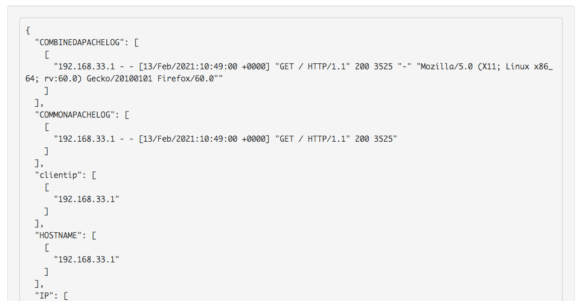


Cool notre pattern grok fonctionne! Revenons alors maintenant sur notre fichier apache.conf et complétons la section filtre, comme suit :
```
input {
    file { path => "/var/log/apache2/access.log" }
}

filter {
    grok {
        match => { "message" => "%{COMBINEDAPACHELOG}" }
    }

    date {
        match => [ "timestamp" , "dd/MMM/yyyy:HH:mm:ss Z" ]
    }

    mutate {
        convert => {
            "response" => "integer"
            "bytes" => "integer"
        }
    }
}
```
J'ai fait exprès de rajouter deux nouveaux filtres [date](https://www.elastic.co/guide/en/logstash/current/plugins-filters-date.html) et [mutate](https://www.elastic.co/guide/en/logstash/current/plugins-filters-mutate.html), car ils nous serviront plus tard pour nos visualisations sur Kibana :

Par défaut, **logstash** basera son *horodatage* sur l'heure à laquelle l'entrée du fichier de log a été lue et non sur l'horodatage fourni par le fichier de logs Apache. D'où l'utilisation du filtre de **date** qui basera son horodatage sur les dates des champs filtrés par grok, soit l'horodatage réel fourni par le fichier de log Apache.

J'utilise également le filtre **mutate** avec l'action convert afin de convertir la réponse HTTP et la taille de la requête qui sont par défaut en type string vers le type entier, car en effet, Kibana gère ses visualisations différemment selon le type de données que vous lui envoyez.

### Sorties **Logstash**
Les points d'arrivée de toute configuration **Logstash** sont vos sorties, lui-même utilise différents plugins de sortie qui envoient les données traitées par la phase de filtrage à une destination particulière (ex: elasticsearch). Par ailleurs, les sorties sont la dernière étape du pipeline **Logstash**.

Pour cet atelier, je vais vous dévoiler comment récupérer les événements sur la sortie standard avec le plugin de sortie *stdout* avant de les envoyer plus tard à *elasticsearch*. Le plugin stdout propose différents formats de sortie, dans notre exemple nous utiliserons le format ***rubydebug***, comme ceci :
```
input {
    file { path => "/var/log/apache2/access.log" }
}

filter {
    grok {
        match => { "message" => "%{COMBINEDAPACHELOG}" }
    }

    date {
        match => [ "timestamp" , "dd/MMM/yyyy:HH:mm:ss Z" ]
    }

    mutate {
        convert => {
            "response" => "integer"
            "bytes" => "integer"
        }
    }
}

output {
    stdout { codec => rubydebug }
}
```
Enregistrez et fermez le fichier conf
#### Debug
Dans cette partie je souhaite vous montrer comment vous pouvez debug votre pipeline **Logstash** afin d'utiliser du mieux ce plugin, pour cela il faut commencer par stopper le service logstash :
```
sudo systemctl stop logstash
```
Ensuite, nous allons vérifier la syntaxe de notre code **Logstash** avec le binaire logstash situé dans `/usr/share/logstash/bin/logstash` en utilisant l'option `-t` ou l'option `--config.test_and_exit` :
##### :warning: Attention
Selon le type d'installation que vous avez choisi, le binaire logstash peut se trouver dans un autre dossier.
```
sudo /usr/share/logstash/bin/logstash --path.settings /etc/logstash -f /etc/logstash/conf.d/apache.conf -t
```
Résultat :

    ...
    Configuration OK
    [2020-06-30T16:58:12,834][INFO ][logstash.runner] ... Config Validation Result: OK. Exiting **Logstash**

#### :information_source: Information
Les différents options du binaire logstash sont disponibles [ici](https://www.elastic.co/guide/en/logstash/current/running-logstash-command-line.html).

Une fois la syntaxe validée, relancez la commande sans l'option -t mais avec l'option -debug:

    sudo /usr/share/logstash/bin/logstash -debug --path.settings /etc/logstash -f /etc/logstash/conf.d/apache.conf

Visitez ensuite depuis votre navigateur la page d'accueil de votre serveur web et revenez sur la sortie standard de votre logstash pour observer le résultat suivant :
```
{
          "bytes" => 3525,
        "message" => "192.168.33.1 - - [13/Feb/2021:11:28:43 +0000] \"GET / HTTP/1.1\" 200 3525 \"-\" \"Mozilla/5.0 (X11; Linux x86_64; rv:60.0) Gecko/20100101 Firefox/60.0\"",
       "@version" => "1",
    "httpversion" => "1.1",
        "request" => "/",
      "timestamp" => "13/Feb/2021:11:28:43 +0000",
           "path" => "/var/log/apache2/access.log",
       "clientip" => "192.168.33.1",
           "host" => "prometheus",
     "@timestamp" => 2021-02-13T11:28:43.000Z,
          "agent" => "\"Mozilla/5.0 (X11; Linux x86_64; rv:60.0) Gecko/20100101 Firefox/60.0\"",
           "verb" => "GET",
           "auth" => "-",
          "ident" => "-",
       "response" => 200,
       "referrer" => "\"-\""
}

```
Passons maintenant à la communication avec elasticsearch.

## ElasticSearch
Modifions ensuite notre fichier **apache.conf** pour communiquer avec **elasticsearch** :
```
input {
    file { path => "/var/log/apache2/access.log" }
}
filter {
    grok {
        match => { "message" => "%{COMBINEDAPACHELOG}" }
    }

    date {
        match => [ "timestamp", "dd/MMM/yyyy:HH:mm:ss Z" ]
    }

    mutate {
        convert => {
            "response" => "integer"
            "bytes" => "integer"
        }
    }
}
output {
    elasticsearch {
         hosts => "localhost:9200"
         index => "apache-%{+YYYY.MM.dd}"
    }
}
```
Vous remarquerez que j'utilise un index dans le bloc de code de sortie elasticsearch car c'est le moyen pour elasticsearch de structurer ses données et de les gérer plus rapidement.
Le nommage utilisé dans notre index actuel est dynamique grâce au pattern `%{+YYYY.MM.dd}`, ce qui aura pour effet de créer un index par jour, permettant à l'administrateur de facilement s'y retrouver en affichant par exemple que les logs d'une date précise dans Kibana, supprimer que les indexs d'une plage de dates , etc ...

N'oubliez pas de démarrer votre service **logstash** avec la commande suivante :
```
sudo systemctl start logstash
```
Après démarrage de votre service, **logstash** va lancer votre pipeline. Ensuite vous pouvez vérifier si l'index s'est correctement créé, pour cela appelez l'**API REST** fournie par elasticsearch, comme suit :
```
curl "localhost:9200/_cat/indices?v"
```
Résultat :
```
health status index                               uuid                   pri rep docs.count docs.deleted store.size pri.store.size
yellow open   apache-2021.02.13                   TZ7GnFf1Q_SVTZgZ74n7qA   1   1      17295            0     12.7mb         12.7mb
```
## Kibana
### Index Patterns
Rendez-vous ensuite sur **Kibana** depuis l'url http://192.16.33.10:5601/. Pour visualiser notre index, allez sur le menu à gauche et cliquez sur "**Stack Management**" :

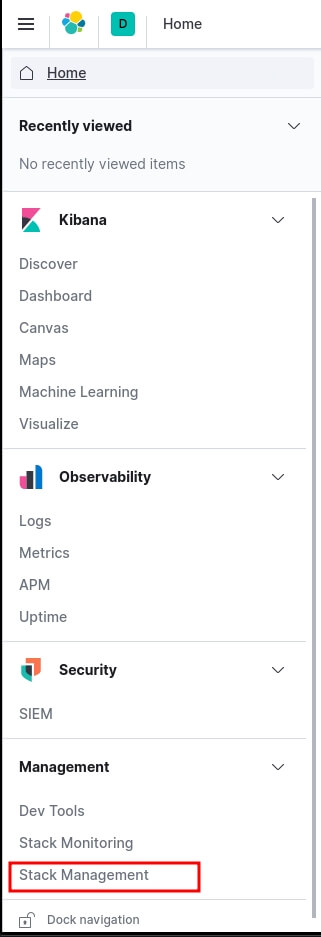

Par la suite, vous devez ajouter un pattern index dans kibana afin de prendre en considération vos indexs quotidiens Apache récupérés par elasticsearch. Cliquez sur "Index Patterns" sur le volet à gauche et cliquez sur le bouton "Create index pattern" :

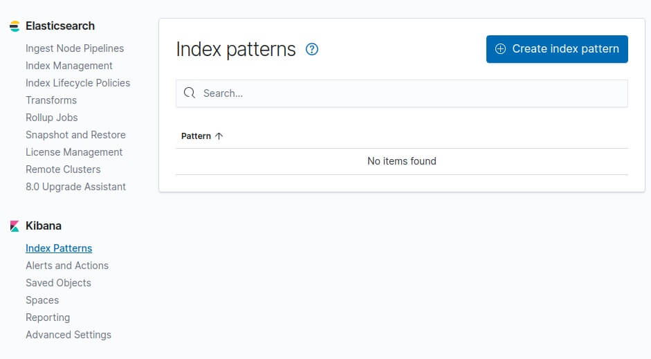

Dans notre cas le préfix de nos indexs apache est "apache-", donc le pattern index à créer dans kibana sera apache-* :

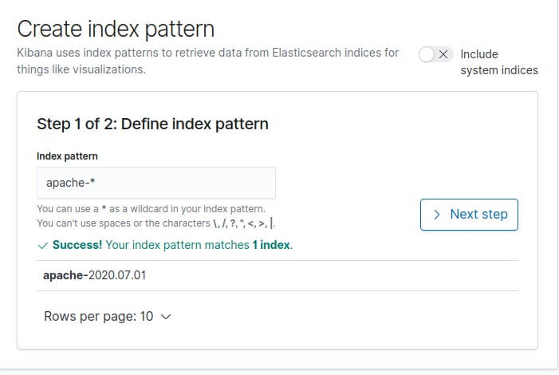

Cliquez ensuite sur "Next Step". Ensuite il nous demande par quel moyen il doit gérer le filtre temporel (timestamp). Ce filtre est utile pour filtrer et affiner nos données par plage horaire. Nous avions prévu le coup sur notre configuration logstash en créant un champ @timestamp, et c'est celui là qu'on sélectionnera :

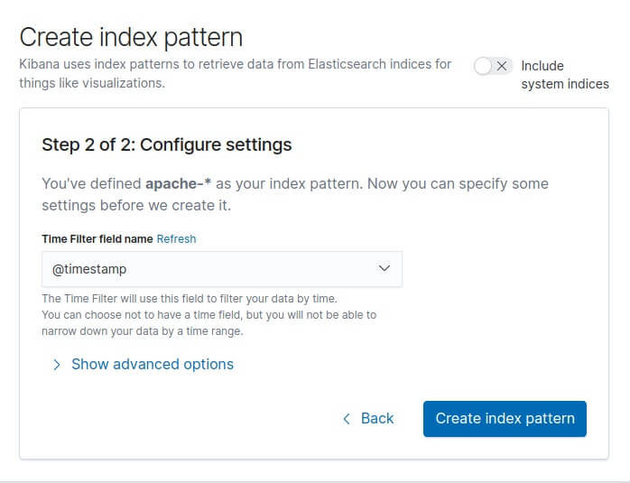

Enfin, cliquez sur le bouton "Create index pattern" et vous verrez apparaître tous vos champs :

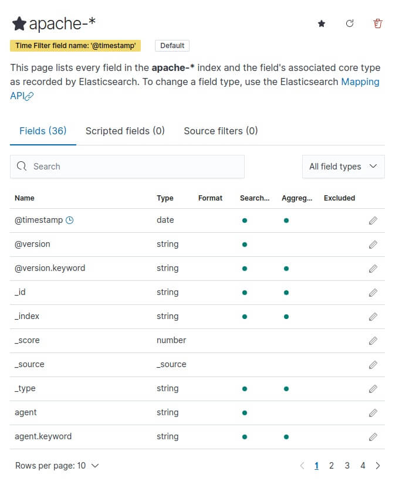

### Découvrir vos logs
Pour découvrir vos logs, sur le menu à gauche cliquez sur Discover :
discover kibana

Ensuite, Faites quelques visites depuis votre navigateur sur la page d'accueil d'apache http://192.168.33.10/ et revenez sur la page de discover :

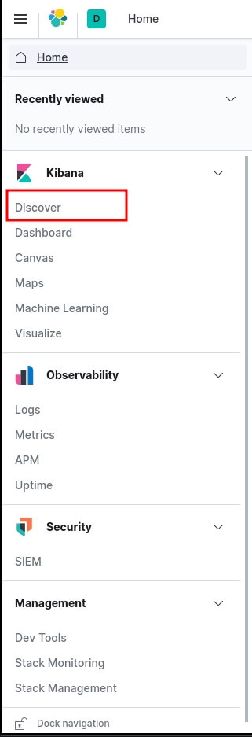

Vous avez également la possibilité de filtrer vos logs par champ depuis la barre de recherche du Discover :
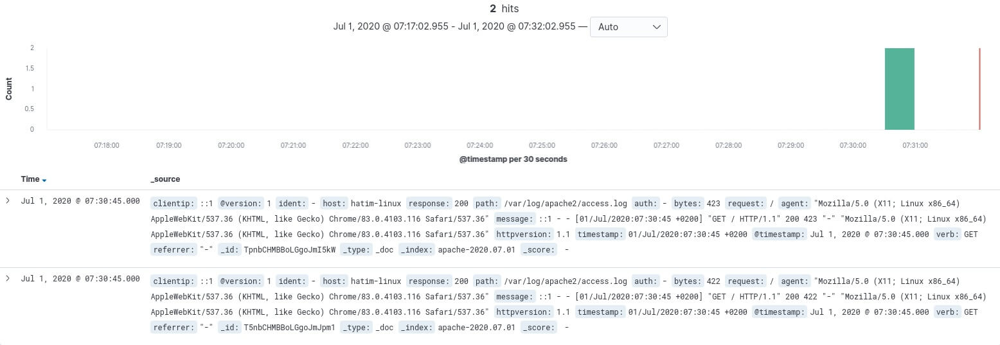

Exemple : "response : 404" pour n'afficher que les requêtes en erreur 404.

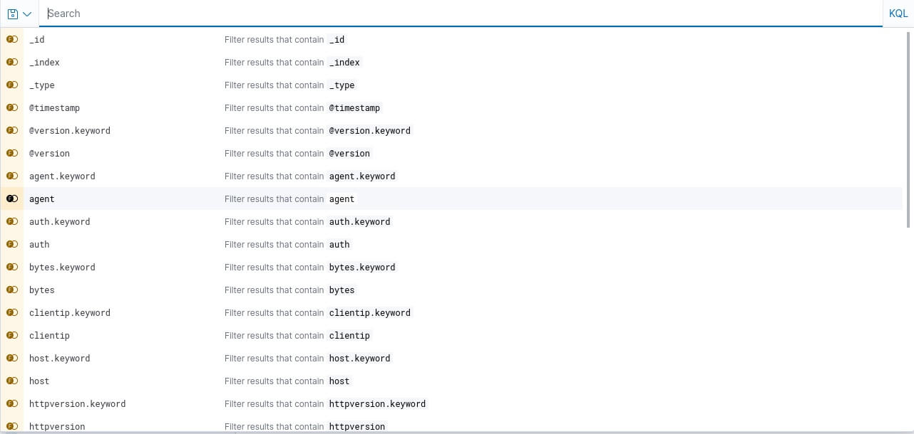

L'étape suivante est de créer un tableau de bord afin de visualiser une collection de visualisations en temps réel. Pour commencer, ouvrez le menu, accédez à Dashboard , puis cliquez sur "Create dashboard" :

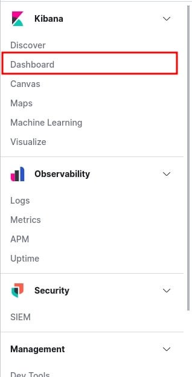

Pour ajouter des éléments à votre dashboard vous devez créer des visualisations Kibana que vous pouvez déplacer et redimensionner dans votre dashboard. Vous pouvez ajouter des visualisations à partir de plusieurs indexs patterns et la même visualisation peut apparaître dans plusieurs tableaux de bord.

Dans notre exemple nous allons commencer par créer une visualisation qui permet d'afficher le nombre total d'utilisateurs unique. Pour ce faire, créez une visualisation en cliquant sur "Create new" et dans la fenêtre de "New visualisation" nous allons choisir le type de visualisation "Metric" :

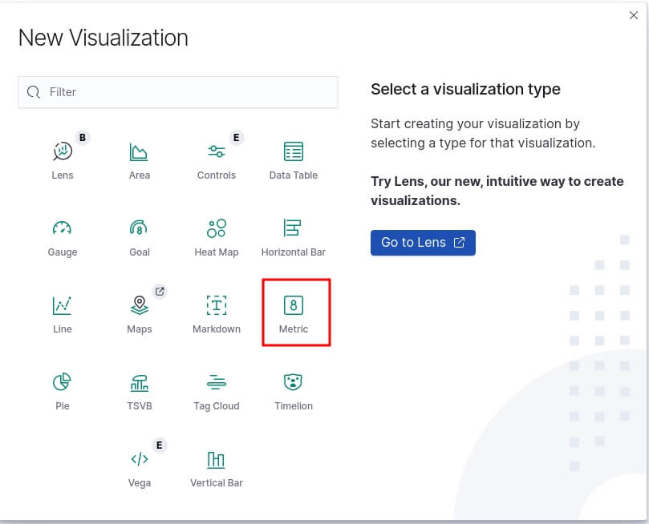

Pour information, voici la liste des types de visualisations Kibana les plus fréquemment utilisées :
Line, area, et bar charts : compare différentes métriques sur l'axe X et Y.
Pie chart : graphique circulaire.
Data table : données en format de tableau.
Metric : affiche une seule métrique.
Goal and gauge : affiche un nombre avec des indicateurs de progression.
Tag cloud : affiche les mots dans un nuage, où la taille du mot correspond à son importance.

On vous demande ensuite de paramétrer votre visualisation, vous devez choisir d'abord votre agrégation qui correspond aux métriques extraient pour générer des valeurs de données. Voici les valeurs les plus communes :
Average : valeur moyenne.
Count : nombre total de documents correspondant à une requête.
Max : la valeur la plus élevée.
Median : médiane.
Min : la valeur la plus basse.
Sum : La valeur totale.
Unique Count : nombre unique d'une métrique.
:information_source: Information
>Dans le langage Elasticsearch, un document correspond aux données JSON sérialisées.

Dans notre cas, nous utiliserons l'agrégation Unique Count en utilisant le champ host :

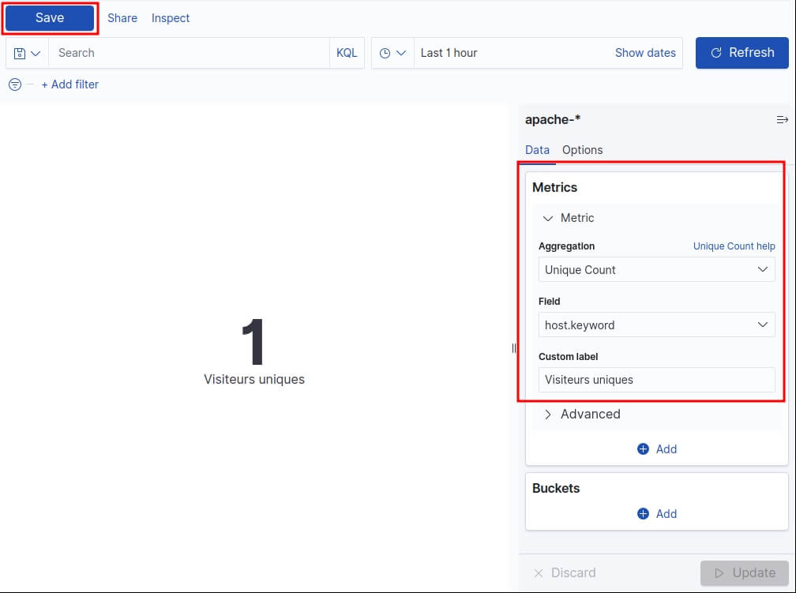

Cliquez ensuite sur "Save" et choisissez le nom de votre visualisation.

Rajoutons un autre graphique qui permet d'afficher la taille moyenne des requêtes temporellement. Pour ce type de besoin nous aurons besoin d'une visualisation de type "area". Pour l'axe Y nous allons utiliser une agrégation de type "Average" sur le champ byte :

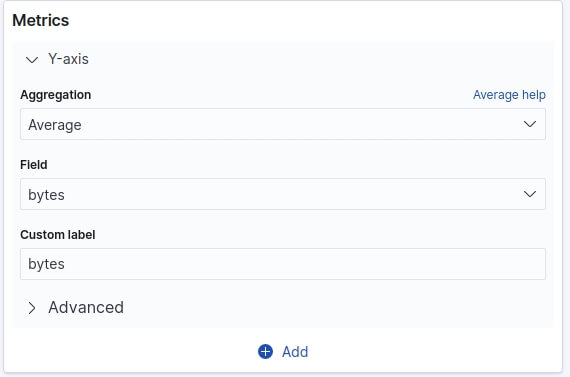

Pour l'axe X ça sera un peu différent car nous utiliserons les Bucket aggregations qui trient les documents en compartiments selon le contenu du document. Voici les valeurs les plus communes :
Date histogram : fractionne un champ de date en compartiments par intervalle.
Date range : valeurs comprises dans une plage de dates que vous spécifiez.
Filter : filtre les données récupérées (ex : traiter que les erreurs 404).
IPv4 range : plages d'adresses IPv4.
Range : plages de valeurs pour un champ numérique.
Terms : Spécifiez le nombre d'éléments supérieurs ou inférieurs d'un champ donné à afficher, classés par nombre ou par une métrique personnalisée.

Pour notre cas nous utiliserons le type "Date histogram" :

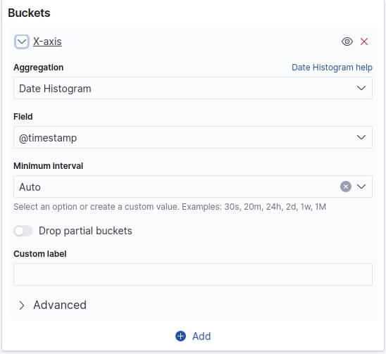

Un dernier graphique avant de clôturer cet atelier. Nous allons cette fois-ci afficher le top des requêtes en erreur sous forme d'un tableau. Créez une nouvelle visualisation de type "Data table" avec comme configuration une agrégation de type "Count" (par défaut) et une Bucket aggregation de type "Terms" sur le champ "request" et trier par ordre décroissant par l'agrégation "Count", ce qui nous affichera pour le moment que les pages web les plus visitées. Cette partie de la configuration ressemblera à ceci :

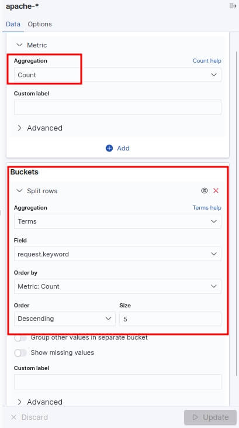

Ensuite pour récupérer que les requêtes en erreur, nous filtrerons ces requêtes si elles ont une réponse différente au code HTTP 200. Pour cela, vous devez cliquer sur le bouton situé en haut à gauche nommée "+ Add filter" et ajouter le filtre suivant :

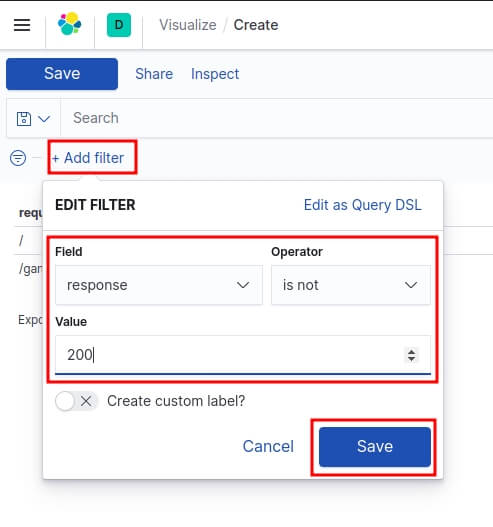

Lorsque vous avez terminé d'ajouter et d'organiser les panneaux, enregistrez le tableau de bord. Dans la barre d'outils Kibana, cliquez sur "Save" et saisissez ensuite le titre du tableau de bord et la description facultative , puis enregistrez votre tableau de bord.


Le dashboard final ressemble à ceci :

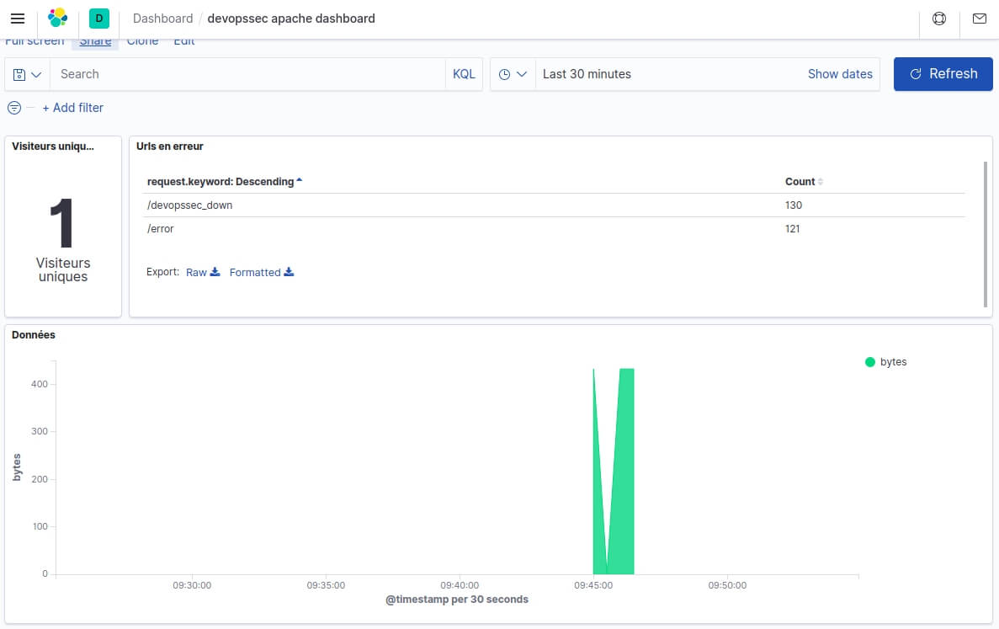

## Conclusion
Dans ce chapitre nous avons appris à utiliser plus en profondeur la suite ELK en partant d'un simple fichier de logs Apache à des données visuelles graphiques en temps réels que vous pouvez manipuler comme vous le souhaitez démontrant la puissance d'ELK et l'utilité d'une solution de centralisation de journalisation.
